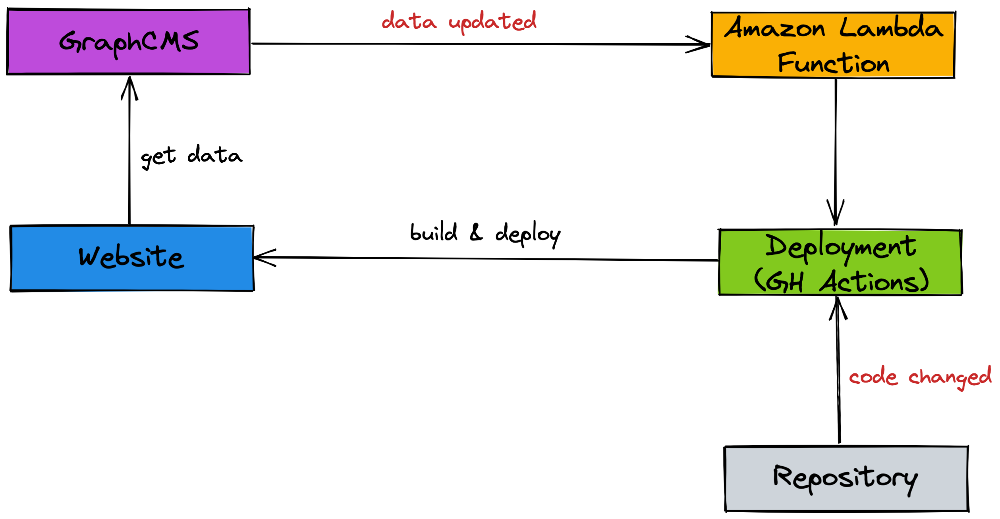

<p align="center">
  <a href="https://teimurjan.dev">
    
  </a>
</p>
<h1 align="center">
  <a href="https://teimurjan.dev">
    teimurjan.dev
  </a>
</h1>
<div align="center">


[](https://percy.io/b3c6e6d8/teimurjan.dev)

</div>

Hey! 👋 This repository contains the source code for my personal website hosted on GitHub Pages.

## 🤷 What makes this project special?

1. Tech stack: [GraphCMS](https://graphcms.com/) + [Gatsby](https://www.gatsbyjs.com/) + [TypeScript](https://www.typescriptlang.org/).
2. [Atomic Design Methodology](https://atomicdesign.bradfrost.com/).
3. [GraphQL TypeScript codegen](https://www.graphql-code-generator.com/).
4. Resume generation on website start/build via [react-pdf](https://react-pdf.org/).
5. GitHub Actions-based automatic deployment.
6. Monorepo project structure with [yarn workspaces](https://yarnpkg.com/features/workspaces).

## 🚀 Quick start

1.  **Run locally**
    ```shell
    yarn start
    ```

2.  **Build**

    ```shell
    yarn build
    ```

3.  **Generate GraphQL typings**

    Run the project locally so Gatsby's GraphQL API is available. After that run:

    ```shell
    yarn codegen
    ```

## ✈️ Deployment

GitHub Actions is mechanism reponsible for the deployments. There is a workflow file [deploy.yml](./.github/workflows/deploy.yml) that starts when the code or data are changed.

<div align="center">
  
</div>

## ➡️ Plans

- [x] Automatic deployment via serverless function when a GraphCMS entity changes.
- [ ] Extra data fethcing from LinkedIn (recommendations, skills, endorsements, etc.).

## 🙏 Contribution

Did you find a bug? Report it in Issues, please.