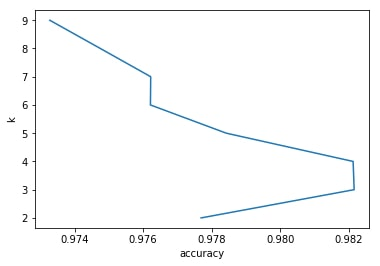
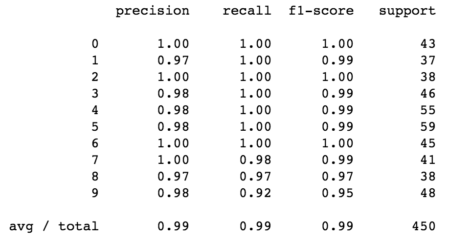

Today's topic is like an introduction into the combination of computer vision and machine learning. All that I'll do here is just fitting kNN model with the data of handwritten digits taken from the [MNIST Database](http://yann.lecun.com/exdb/mnist/) and also checking its accuracy.

## Set up environment

I'll be using [Anaconda](https://anaconda.org/anaconda/python) as my environment so I'll skip the step about installing the dependencies.

## Import dependencies

```python
from sklearn.model_selection import train_test_split, cross_val_score
from sklearn.neighbors import KNeighborsClassifier
from sklearn.metrics import classification_report
from sklearn import datasets
import numpy as np
import matplotlib.pyplot as plt
import cv2
```

## Prepare data

The dataset from [MNIST Database](http://yann.lecun.com/exdb/mnist/) is available in the datasets module of sklearn, so let's start with loading the data.

```python
digits = datasets.load_digits()
```

Now we need to have two different datasets: one for testing and the other for training our model.

```python
(X_train, X_test, y_train, y_test) = train_test_split(
    digits.data, digits.target, test_size=0.25, random_state=42
)
```

## Fit the model

Let’s find the best parameter k. We can’t just take the k out of our mind, so let’s train model and evaluate accuracy for different k.

```python
ks = np.arange(2, 10)
scores = []
for k in ks:
    model = KNeighborsClassifier(n_neighbors=k)
    score = cross_val_score(model, X_train, y_train, cv=5)
    score.mean()
    scores.append(score.mean())
plt.plot(scores, ks)
plt.xlabel('accuracy')
plt.ylabel('k')
```

As the output we can see such plot:



Looking at this chart we can understand that the best accuracy was reached when k was 3.
So from now, we'll be using k=3 for our model.

### Evaluate the model on the test data

```python
model = KNeighborsClassifier(n_neighbors=3)
model.fit(X_train, y_train)

z = model.predict(X_test)
```

Let's now create a classification report to see the accuracy.

```python
print(classification_report(y_test, z))
```



Amazing! We reached 99% accuracy!

## To be continued

In the [next article](/blog/digits-recognizer-python-flask-react-2) I’ll move this classifier into an API built with Flask.
