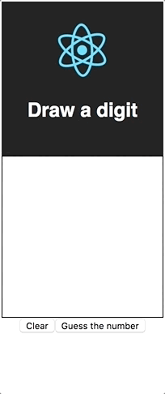

We've passed through the [training machine learning alogrithm](/blog/digits-recognizer-python-flask-react-1), [image processing and integrating the trained algorithm with the Flask backend](/blog/digits-recognizer-python-flask-react-2) and now I am here to put the final by implementing a React application for drawing digits.

## Set up environment

I used [CRA boilerplate](https://github.com/facebook/create-react-app) but it's not so important. You can configure your application from scratch if you don't cherish the time.

```sh
create-react-app frontend
cd frontend
```

So after setting up React environment we also need one more dependency for drawing. My choice fell on [react-sketch](https://github.com/tbolis/react-sketch). It perfectly matches our needs.

```sh
npm i react-sketch
```

Now we have everything to make up our drawer.

## Implement the app

The whole App can be written in just 80 lines of code. 🙂

```js
import React, { Component } from "react";
import logo from "./assets/logo.svg";
import "./assets/App.css";
import { SketchField, Tools } from "react-sketch";
import { makePrediction } from "./api";

const pixels = count => `${count}px`;
const percents = count => `${count}px`;

const MAIN_CONTAINER_WIDTH_PX = 200;
const MAIN_CONTAINER_HEIGHT = 100;
const MAIN_CONTAINER_STYLE = {
  width: pixels(MAIN_CONTAINER_WIDTH_PX),
  height: percents(MAIN_CONTAINER_HEIGHT),
  margin: "0 auto"
};

const SKETCH_CONTAINER_STYLE = {
  border: "1px solid black",
  width: pixels(MAIN_CONTAINER_WIDTH_PX - 2),
  height: pixels(MAIN_CONTAINER_WIDTH_PX - 2),
  backgroundColor: "white"
};

class App extends Component {
  state = {
    prediction: undefined,
    errors: undefined
  };

  handleSubmit = e => {
    const image = this.sketch.toDataURL();
    this.setState({
      prediction: undefined,
      errors: undefined
    });
    makePrediction(image)
      .then(prediction => this.setState({ prediction }))
      .catch(errors => this.setState({ errors }));
  };

  handleClear = e => this.sketch.clear();

  render() {
    const { prediction, errors } = this.state;
    return (
      <div className="App" style={MAIN_CONTAINER_STYLE}>
        <div>
          <header className="App-header">
            
            <h1 className="App-title">Draw a digit</h1>
          </header>
          <div style={SKETCH_CONTAINER_STYLE}>
            <SketchField
              ref={sketch => (this.sketch = sketch)}
              width="100%"
              height="100%"
              tool={Tools.Pencil}
              imageFormat="jpg"
              backgroundColor="white"
              lineColor="gray"
              lineWidth={8}
            />
          </div>
          {prediction && <h3>Predicted value is: {prediction}</h3>}
          <button onClick={this.handleClear}>Clear</button>
          <button onClick={this.handleSubmit}>Guess the number</button>
          {errors && <p style={{ color: "red" }}>Something went wrong</p>}
        </div>
      </div>
    );
  }
}

export default App;
```

Here is no unfamiliar things, I guess, except the `SketchField` component. It has props which are perfectly named, so as you see we have width and height attributes, the tool with which we'll draw our image, its format, the colors of background and pencil and also the width of line. But I did not say anything about `ref`. It is used here in order to get our image. So we assign SketchField ref to `this.sketch` and then when "Submit" button is clicked we can get the drawen image by calling `.toDataURL()`.

One more unknown thing is `makePrediction` function. It is a simple API call with status code validation.

```js
const validateStatusCode = response =>
  new Promise((resolve, reject) => {
    const status = response.status;
    const next = status < 400 ? resolve : reject;
    response.text().then(next);
  });

export const makePrediction = image =>
  fetch("/api/predict", {
    method: "POST",
    headers: {
      "Content-Type": "application/json"
    },
    body: JSON.stringify({ image })
  }).then(validateStatusCode);
```

## Test the app

Let's now test our application. Start it with:

```sh
npm run start
```

And go to the `localhost:3000`.



Checkout the [DEMO](web-digits-recognizer.herokuapp.com). All code is available on my [Github repository ](https://github.com/teimurjan/digits-recognizer).

## Conclusion

I understand that the quality of this classifier is not so good as you want. That's it because of the big difference between train and actual data. But the reason of creating this project is just to learn something new and share this knowledge with others. Thank you for reading this article, hope you've discovered lots of interesting things, keep on studying and improve yourselves. 🙌
