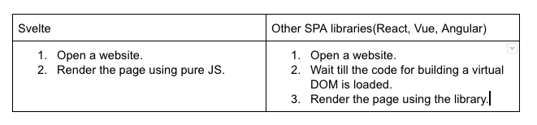

Web applications are becoming more popular from day to day. It’s like a growing universe which people opt for its simplicity, speed and cross-platform availability. Single Page Applications(SPAs) have taken a huge part in this process. Frameworks like Angular, Vue and React help developers to deliver the best user experience in a short period of time leaving the code supportable and extendable. These tools have been remaining the most popular ones in the area and have many advantages over the newly created packages for a long time. It’s felt like an oligopoly in the SPA world. However, a group of initiative developers targeting this market could enter there with a serious competitor for the existing frameworks - Svelte.

Svelte is called as a new approach to building user interfaces. It’s actually new, but what are the things that make it so. Let’s dive into them by creating a login form which almost any application have.

# Architecture
Svelte is architectured in the way to be faster than any other library. It’s reached by shifting the step of loading a framework for building a virtual DOM. Instead it’s compiled to the VanillaJS so the application has no dependencies needed to start.



  
The illustration above describes why Svelte is the absolute winner in the start-up performance competition. That’s not gained by any sort of optimization but by usage of the plain browser Javascript compiler instead of side-compilers.

# Installation
Svelte installation is as easy as pie which makes its usage even more pleasant. At first it’s needed to download the project’s template:

```sh
npx degit sveltejs/template svelte-login-form
```

Completion of the command above means that we have a Svelte project template. It’s empty for the moment and the required NPM packages are not installed yet. Let’s fix it.

```sh
cd svelte-login-form
npm install
```

Now, the application is ready to start by using the following command:

```sh
npm dev start
```

# Structure
Any Svelte component may contain the following sections:
* script
* style
* template

Let’s look at the example in `src/App.svelte` file.
```html
<script>
  export let name;
</script>

<style>
  h1 {
    color: purple;
  }
</style>

<h1>{name}</h1>
```
Script section is an optional JS block, which can declare variables and functions that will be used in the template block.
Style is an optional block with the CSS rules for the template block. It’s important to understand that these rules are scoped to the component. Applying a style to a `p` element won’t affect all the paragraphs on the page.
Template block is the only required block, which is the presentation of a component. It’s tightly bound to the style and script blocks as they determine how the view will be styled and how it will behave.

Returning to the login form we’re building. Let’s create a new file `LoginForm.svelte` inside the `src` folder with the following content:

```html
<style>
  form {
    background: #fff;
    padding: 50px;
    width: 250px;
    height: 400px;
    display: flex;
    flex-direction: column;
    justify-content: center;
    align-items: center;
    box-shadow: 0px 20px 14px 8px rgba(0, 0, 0, 0.58);
  }

  label {
    margin: 10px 0;
    align-self: flex-start;
    font-weight: 500;
  }

  input {
    border: none;
    border-bottom: 1px solid #ccc;
    margin-bottom: 20px;
    transition: all 300ms ease-in-out;
    width: 100%;
  }

  input:focus {
    outline: 0;
    border-bottom: 1px solid #666;
  }

  button {
    margin-top: 20px;
    background: black;
    color: white;
    padding: 10px 0;
    width: 200px;
    border-radius: 25px;
    text-transform: uppercase;
    font-weight: bold;
    cursor: pointer;
    transition: all 300ms ease-in-out;
  }

  button:hover {
    transform: translateY(-2.5px);
    box-shadow: 0px 1px 10px 0px rgba(0, 0, 0, 0.58);
  }

  h1 {
    margin: 10px 20px 30px 20px;
    font-size: 40px;
  }

</style>


<form>
  <h1>👤</h1>

  <label>Email</label>
  <input name=”email” placeholder=”name@example.com” />

  <label>Password</label>
  <input name=”password” type=”password” placeholder=”password” />

  <button type="submit">Log in 🔒</button>
</form>
``` 

It’s a dumb styled component that we’ll extend later. This component should be used inside the App component. Edit the `src/App.svelte` so it’ll look like this:

```html
<script>
  import LoginForm from "./LoginForm.svelte";
</script>

<style>
  section {
    height: 100vh;
	width: 100%;
	display: flex;
	justify-content: center;
	align-items: center;
	background: linear-gradient(to right, #cd76e2, #e358ab);
  }
</style>

<section>
  <LoginForm />
</section>
```
Now, visiting localhost:5000 should show the created form.
State
Any component is Svelte is able to have its own state. State is a variable or group of variables which can be used inside the template. In turn the template will be re-rendered once a state piece is changed.

We’ll declare email and password state variables where the form values for the appropriate fields will be stored. It’ll give us access to the form values, so we’ll create a fake function to handle form submissions too.

```html
<script>
  let email = "";
  let password = "";

  let isLoading = false;

  const handleSubmit = () => {
      isLoading = true;
      // Simulate network request
      setTimeout(() => {
        isLoading = false;
        // Authorize the user
      }, 1000);
  };
</script>

<style>
/* Style is unchanged */
</style>


<form on:submit|preventDefault={handleSubmit}>
  <h1>👤</h1>

  <label>Email</label>
  <input name="email" placeholder="name@example.com" bind:value={email} />

  <label>Password</label>
  <input name="password" type="password" bind:value={password} />


    {#if isLoading}Logging in...{:else}Log in 🔒{/if}
</form>
```

State variables are declared as common Javascript variables, but in order to bind them to the form fields, it is necessary to use `bind:value` directive. There are also couple unfamiliar things: 
* ```on:submit|preventDefault``` is a short-hand for preventing default events’ behaviour. It’s so comfortable to have it in this way rather than writing `e.preventDefault()` every time.
* ```{#if isLoading}Logging in...{:else}Log in 🔒{/if}``` is about Svelte’s template syntax. As there is no JS in the template block, there is a special syntax for using ifs, loops etc.


Finally, let’s add the validation to our form to make it 100% complete:
```html
<script>
  let email = "";
  let password = "";

  let isLoading = false;

  let errors = {};

  const handleSubmit = () => {
    errors = {};

    if (email.length === 0) {
      errors.email = "Field should not be empty";
    }
    if (password.length === 0) {
      errors.password = "Field should not be empty";
    }

    if (Object.keys(errors).length === 0) {
      isLoading = true;
      // Simulate network request
      setTimeout(() => {
        isLoading = false;
        // Authorize the user
      }, 1000);
    }
  };
</script>

<style>
  // Previous styles unchanged

  .errors {
    list-style-type: none;
    padding: 10px;
    margin: 0;
    border: 2px solid #be6283;
    color: #be6283;
    background: rgba(190, 98, 131, 0.3);
  }
</style>

<form on:submit|preventDefault={handleSubmit}>
  <h1>👤</h1>

  <label>Email</label>
  <input name="email" placeholder="name@example.com" bind:value={email} />

  <label>Password</label>
  <input name="password" type="password" bind:value={password} />

  <button type="submit">
    {#if isLoading}Logging in...{:else}Log in 🔒{/if}
  </button>

  {#if Object.keys(errors).length > 0}
    <ul class="errors">
      {#each Object.keys(errors) as field}
        <li>{field}: {errors[field]}</li>
      {/each}
    </ul>
  {/if}
</form>
```

We’ve made a pretty login form with Svelte. However, after a successful login operation nothing happens.

<div align="center">
    
</div>

Such a behaviour caused by doing nothing inside our fake submission function.